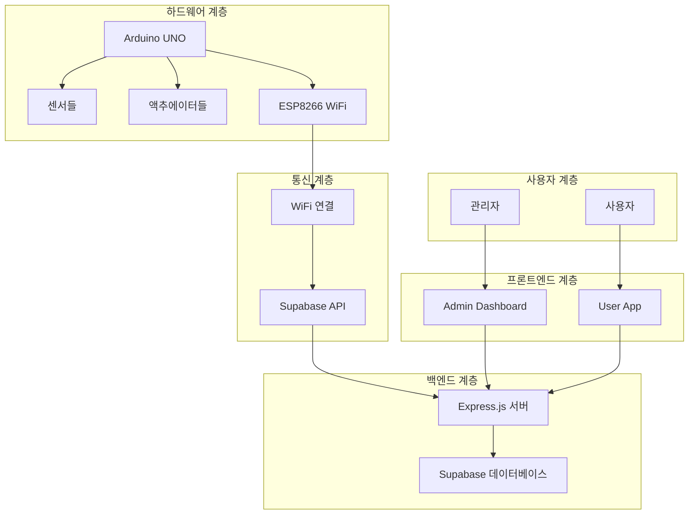
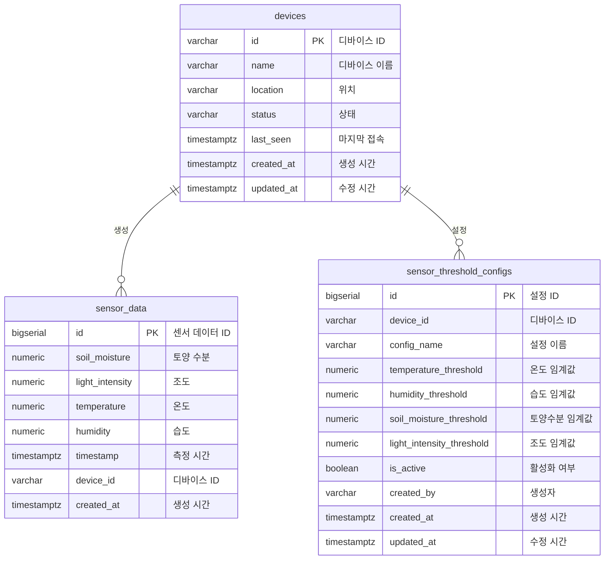

# 🌱 FarmLink - 스마트팜 IoT 시스템

<div align="center">


**ESP8266 기반 스마트팜 모니터링 및 자동 제어 시스템**

[](https://www.arduino.cc/)
[](https://reactjs.org/)
[](https://supabase.com/)
[](https://nodejs.org/)

</div>

## 📋 목차

- [프로젝트 개요](#-프로젝트-개요)
- [시스템 아키텍처](#-시스템-아키텍처)
- [주요 기능](#-주요-기능)
- [프로젝트 구조](#-프로젝트-구조)
- [하드웨어 구성](#-하드웨어-구성)
- [빠른 시작](#-빠른-시작)
- [API 문서](#-api-문서)
- [데이터베이스](#-데이터베이스)
- [개발 가이드](#-개발-가이드)
- [배포](#-배포)
- [기여하기](#-기여하기)

## 🎯 프로젝트 개요

FarmLink는 ESP8266 기반의 스마트팜 IoT 시스템으로, 실시간 센서 모니터링과 자동 제어 기능을 제공합니다. Arduino를 통해 센서 데이터를 수집하고, Supabase 클라우드를 통해 데이터를 저장하며, React 기반 웹/모바일 앱으로 모니터링할 수 있습니다.

### 핵심 가치
- 🌡️ **실시간 모니터링**: 온도, 습도, 토양수분, 조도 실시간 측정
- 🤖 **자동 제어**: 임계값 기반 워터펌프, 팬, LED 자동 제어
- ☁️ **클라우드 연동**: Supabase를 통한 안정적인 데이터 저장
- 📱 **크로스 플랫폼**: 웹과 모바일에서 동시 접근 가능
- 🔧 **확장성**: 새로운 센서와 기능 추가 용이

## 🏗️ 시스템 아키텍처



## ✨ 주요 기능

### 🔍 센서 모니터링
- **온습도 센서 (DHT11)**: 실시간 온도/습도 측정
- **토양수분 센서**: 토양의 수분 함량 측정
- **조도 센서 (CDS)**: 주변 조도 측정
- **LCD 디스플레이**: 현장에서 데이터 확인

### 🤖 자동 제어 시스템
- **워터펌프**: 토양수분 임계값 미만 시 자동 급수
- **팬**: 온도/습도 임계값 초과 시 환기
- **LED**: 조도 부족 시 인공 조명 제공

### ☁️ 클라우드 기능
- **실시간 데이터 저장**: Supabase를 통한 안정적인 데이터 저장
- **통계 분석**: 센서 데이터의 통계 및 트렌드 분석
- **알림 시스템**: 임계값 기반 자동 알림
- **원격 제어**: 웹/모바일을 통한 원격 제어

## 📁 프로젝트 구조

```
FarmLink/
├── 📁 arduino-project/          # Arduino 하드웨어 코드
│   ├── farmlink_esp8266/        # ESP8266 메인 코드
│   ├── farmlink_controller.py   # Python 제어 스크립트
│   └── README.md               # Arduino 프로젝트 문서
├── 📁 supabase-api/            # 백엔드 API 서버
│   ├── server.js               # Express.js 서버
│   ├── schema.sql              # 데이터베이스 스키마
│   ├── types.ts                # TypeScript 타입 정의
│   └── README.md               # API 서버 문서
├── 📁 admin-dashboard/         # 관리자 대시보드 (React)
│   ├── src/                    # React 소스 코드
│   └── README.md               # 대시보드 문서
├── 📁 user-app/                # 사용자 앱 (React Native)
│   ├── src/                    # React Native 소스 코드
│   └── README.md               # 사용자 앱 문서
├── 📁 docs/                    # 프로젝트 문서
│   ├── arduino-circuit-diagram.md    # 회로도
│   ├── database-erd.md              # 데이터베이스 ERD
│   └── database-table-definitions.md # 테이블 정의서
└── README.md                   # 이 파일
```

## 🔧 하드웨어 구성

### 메인 보드
- **Arduino UNO**: 메인 컨트롤러
- **ESP8266 WiFi 모듈**: 무선 통신

### 센서
- **DHT11**: 온습도 센서 (Pin 4)
- **토양수분 센서**: 아날로그 센서 (A0)
- **조도 센서 (CDS)**: 아날로그 센서 (A1)

### 액추에이터
- **워터펌프**: 모터 드라이버 (Pin 9, 10)
- **팬**: 모터 드라이버 (Pin 5, 6)
- **LED**: PWM 제어 (Pin 3)

### 디스플레이
- **LCD I2C 16x2**: 현장 모니터링 (SDA: A4, SCL: A5)

### 회로도 및 연결 정보
자세한 회로도와 Pull-up/Pull-down 저항 정보는 [Arduino 회로도 문서](docs/arduino-circuit-diagram.md)를 참조하세요.

## 🚀 빠른 시작

### 1. 하드웨어 설정

```bash
# Arduino 프로젝트 디렉토리로 이동
cd arduino-project

# Arduino IDE에서 farmlink_esp8266.ino 열기
# WiFi 설정 및 Supabase URL/Key 설정 후 업로드
```

### 2. 백엔드 API 서버 실행

```bash
# Supabase API 디렉토리로 이동
cd supabase-api

# 의존성 설치
npm install

# 환경 변수 설정
cp env.local.example env.local
# env.local 파일에서 Supabase 설정 수정

# 서버 실행
npm start
```

### 3. 프론트엔드 실행

#### 관리자 대시보드
```bash
cd admin-dashboard
npm install
npm start
```

#### 사용자 앱 (웹)
```bash
cd user-app
npm install
npm run web
```

### 4. 데이터베이스 설정

```bash
# Supabase 프로젝트에서 schema.sql 실행
cd supabase-api
npm run setup-db
```

## 📚 API 문서

### 센서 데이터 API
- `POST /api/sensor-data` - 센서 데이터 저장
- `GET /api/sensor-data` - 센서 데이터 조회
- `GET /api/sensor-data/stats` - 센서 데이터 통계

### 디바이스 관리 API
- `GET /api/devices` - 디바이스 목록 조회
- `GET /api/device-status/:deviceId` - 디바이스 상태 조회

### 임계치 설정 API
- `GET /api/threshold-configs/:deviceId` - 임계치 설정 조회
- `POST /api/threshold-configs/:deviceId` - 임계치 설정 생성
- `PUT /api/threshold-configs/:id` - 임계치 설정 업데이트
- `DELETE /api/threshold-configs/:id` - 임계치 설정 삭제

### 제어 API
- `POST /api/control/:deviceId` - 디바이스 제어

자세한 API 문서는 [Supabase API 문서](supabase-api/README.md)를 참조하세요.

## 🗄️ 데이터베이스

### 테이블 구조
- **devices**: 디바이스 정보
- **sensor_data**: 센서 측정 데이터
- **sensor_threshold_configs**: 임계치 설정

### ERD 다이어그램


자세한 데이터베이스 정보는 [데이터베이스 문서](docs/database-table-definitions.md)를 참조하세요.

## 🛠️ 개발 가이드

### 개발 환경 설정

1. **Node.js** (v16 이상)
2. **Arduino IDE** (v1.8 이상)
3. **Python** (v3.8 이상)
4. **Supabase 계정**

### 코드 스타일

- **JavaScript/TypeScript**: ESLint + Prettier
- **Arduino C++**: Arduino IDE 기본 포맷터
- **Python**: PEP 8

### 테스트

```bash
# API 서버 테스트
cd supabase-api
npm test

# 프론트엔드 테스트
cd admin-dashboard
npm test
```

### 디버깅

- **Arduino**: 시리얼 모니터 사용
- **API**: 로그 파일 확인
- **프론트엔드**: 브라우저 개발자 도구

## 🚀 배포

### 하드웨어 배포
1. Arduino 코드 업로드
2. 하드웨어 연결 및 테스트
3. WiFi 설정 확인

### 백엔드 배포
```bash
# Heroku 배포 예시
cd supabase-api
git subtree push --prefix supabase-api heroku main
```

### 프론트엔드 배포
```bash
# Vercel 배포 예시
cd admin-dashboard
vercel --prod
```

## 🤝 기여하기

1. Fork the Project
2. Create your Feature Branch (`git checkout -b feature/AmazingFeature`)
3. Commit your Changes (`git commit -m 'Add some AmazingFeature'`)
4. Push to the Branch (`git push origin feature/AmazingFeature`)
5. Open a Pull Request

### 기여 가이드라인
- 코드 작성 전 이슈 생성
- 명확한 커밋 메시지 작성
- 테스트 코드 포함
- 문서 업데이트

## 📄 라이선스

이 프로젝트는 MIT 라이선스 하에 배포됩니다. 자세한 내용은 `LICENSE` 파일을 참조하세요.

## 📞 지원 및 문의

- **이슈 리포트**: [GitHub Issues](https://github.com/your-repo/farmlink/issues)
- **문서**: [프로젝트 문서](docs/)
- **이메일**: your-email@example.com

## 🙏 감사의 말

- Arduino 커뮤니티
- Supabase 팀
- React 개발자 커뮤니티
- 모든 기여자들

---

<div align="center">

**🌱 FarmLink로 스마트한 농업을 시작하세요! 🌱**

[](https://github.com/your-repo/farmlink)
[](https://github.com/your-repo/farmlink)

</div>
