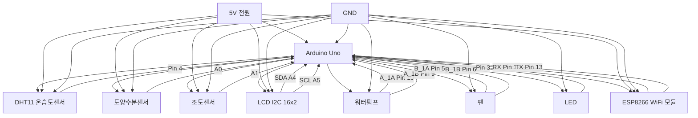
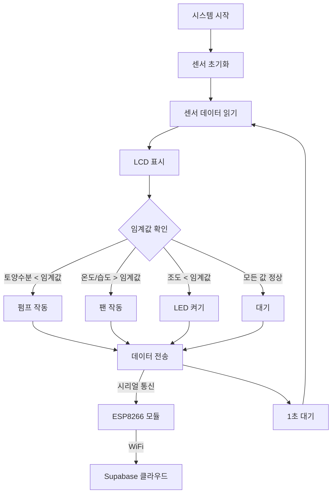
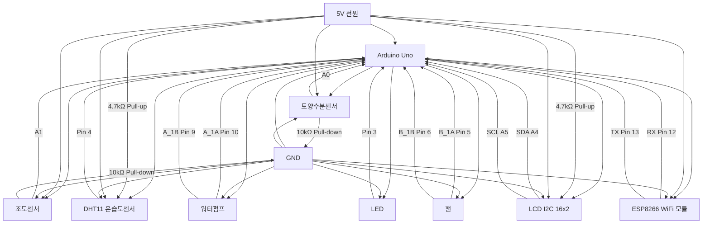

# FarmLink ESP8266 스마트팜 시스템 회로도

## 시스템 개요
ESP8266 기반 스마트팜 모니터링 및 자동 제어 시스템의 회로 연결도를 Mermaid 다이어그램으로 표현합니다.

## 회로도 (Mermaid)

## 상세 핀 연결표

| 구성요소 | 핀 번호 | Arduino 핀 | 기능 | Pull-up/Pull-down |
|---------|---------|------------|------|-------------------|
| **센서** | | | | |
| DHT11 | VCC | 5V | 전원 | - |
| DHT11 | GND | GND | 그라운드 | - |
| DHT11 | Data | Pin 4 | 데이터 신호 | **Pull-up 4.7kΩ** |
| 토양수분센서 | VCC | 5V | 전원 | - |
| 토양수분센서 | GND | GND | 그라운드 | - |
| 토양수분센서 | Signal | A0 | 아날로그 입력 | **Pull-down 10kΩ** |
| 조도센서 | VCC | 5V | 전원 | - |
| 조도센서 | GND | GND | 그라운드 | - |
| 조도센서 | Signal | A1 | 아날로그 입력 | **Pull-down 10kΩ** |
| **디스플레이** | | | | |
| LCD I2C | VCC | 5V | 전원 | - |
| LCD I2C | GND | GND | 그라운드 | - |
| LCD I2C | SDA | A4 | I2C 데이터 | **Pull-up 4.7kΩ** |
| LCD I2C | SCL | A5 | I2C 클럭 | **Pull-up 4.7kΩ** |
| **액추에이터** | | | | |
| 워터펌프 | A_1A | Pin 10 | 모터 제어 A | - |
| 워터펌프 | A_1B | Pin 9 | 모터 제어 B | - |
| 팬 | B_1A | Pin 5 | 모터 제어 A | - |
| 팬 | B_1B | Pin 6 | 모터 제어 B | - |
| LED | + | Pin 3 | PWM 제어 | - |
| **통신** | | | | |
| ESP8266 | VCC | 3.3V | 전원 | - |
| ESP8266 | GND | GND | 그라운드 | - |
| ESP8266 | TX | Pin 12 | 시리얼 송신 | - |
| ESP8266 | RX | Pin 13 | 시리얼 수신 | - |

## 시스템 동작 흐름

## Pull-up/Pull-down 저항 상세 설명

### 1. **DHT11 온습도 센서**
- **Pull-up 저항**: 4.7kΩ (VCC와 Data 핀 사이)
- **목적**: 디지털 신호의 안정성 확보, 플로팅 상태 방지
- **연결**: VCC(5V) → 4.7kΩ 저항 → Data 핀(Pin 4)

### 2. **토양수분 센서**
- **Pull-down 저항**: 10kΩ (Signal 핀과 GND 사이)
- **목적**: 센서가 연결되지 않았을 때 0V로 안정화
- **연결**: Signal 핀(A0) → 10kΩ 저항 → GND

### 3. **조도 센서 (CDS)**
- **Pull-down 저항**: 10kΩ (Signal 핀과 GND 사이)
- **목적**: 어두운 환경에서 0V로 안정화
- **연결**: Signal 핀(A1) → 10kΩ 저항 → GND

### 4. **LCD I2C 통신**
- **Pull-up 저항**: 4.7kΩ (SDA, SCL 각각)
- **목적**: I2C 버스의 HIGH 상태 유지, 통신 안정성
- **연결**: 
  - SDA(A4) → 4.7kΩ 저항 → VCC(5V)
  - SCL(A5) → 4.7kΩ 저항 → VCC(5V)

## 회로도 (Pull-up/Pull-down 포함)

## 주의사항

1. **전원 공급**: ESP8266은 3.3V로 동작하므로 전압 분압기나 레귤레이터 필요
2. **모터 제어**: 워터펌프와 팬은 고전류를 소모하므로 릴레이나 모터 드라이버 사용 권장
3. **I2C 통신**: LCD와 다른 I2C 장치가 충돌하지 않도록 주소 확인 필요
4. **시리얼 통신**: ESP8266과의 통신 시 전압 레벨 매칭 필요
5. **Pull-up/Pull-down 저항**: 
   - 저항값이 너무 작으면 전류 소모 증가
   - 저항값이 너무 크면 신호 무결성 문제 발생
   - 권장값: Pull-up 4.7kΩ, Pull-down 10kΩ

## 확장 가능성

- 추가 센서 연결 (pH 센서, EC 센서 등)
- 카메라 모듈 추가
- 블루투스 통신 추가
- SD 카드 데이터 로깅
- 실시간 알림 시스템
