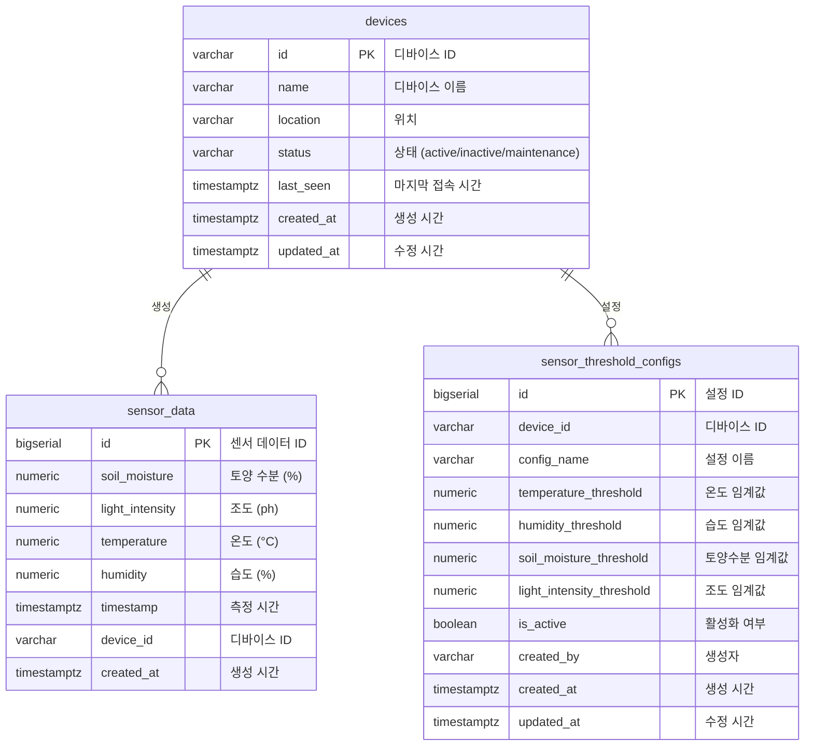
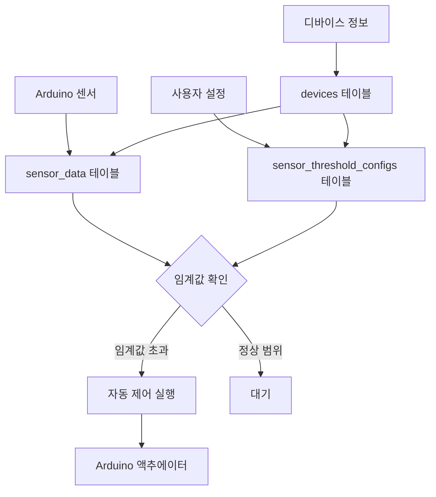

# FarmLink 데이터베이스 ERD (Entity Relationship Diagram)

## 개요
FarmLink 스마트팜 시스템의 Supabase 데이터베이스 구조를 Mermaid ERD로 표현합니다.

**실제 데이터베이스에는 3개 테이블만 존재합니다.**

## ERD 다이어그램

## 테이블 관계 설명

### 1. **devices (디바이스)**
- **역할**: 시스템의 중심 테이블로 모든 디바이스 정보를 관리
- **관계**: 
  - `sensor_data`: 1:N (하나의 디바이스가 여러 센서 데이터 생성)
  - `sensor_threshold_configs`: 1:N (하나의 디바이스가 여러 임계값 설정)

### 2. **sensor_data (센서 데이터)**
- **역할**: 실시간 센서 측정값 저장
- **관계**:
  - `devices`: N:1 (여러 센서 데이터가 하나의 디바이스에 속함)

### 3. **sensor_threshold_configs (센서 임계치 설정)**
- **역할**: 사용자가 설정한 임계값 구성 관리
- **관계**:
  - `devices`: N:1 (여러 설정이 하나의 디바이스에 속함)

## 데이터 흐름

## 주요 특징

1. **단순화**: 3개 테이블로 간단한 구조
2. **정규화**: 데이터 중복을 최소화하고 무결성 보장
3. **확장성**: 새로운 디바이스나 센서 타입 추가 용이
4. **유연성**: 다양한 임계값 설정 구성 지원
5. **보안**: RLS(Row Level Security) 정책으로 데이터 접근 제어

## 실제 데이터베이스 현황

- **총 테이블 수**: 3개
- **주요 테이블**: devices, sensor_data, sensor_threshold_configs
- **인덱스**: 성능 최적화를 위한 적절한 인덱스 설정
- **RLS**: 모든 테이블에 Row Level Security 적용
