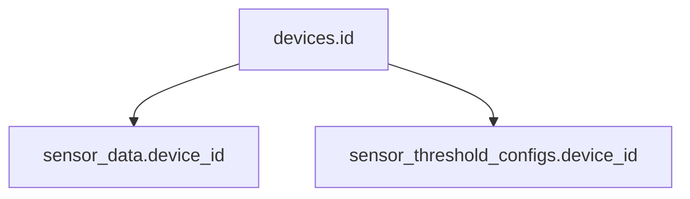

# FarmLink 데이터베이스 테이블 정의서

## 개요
FarmLink 스마트팜 시스템의 Supabase 데이터베이스 테이블 상세 정의서입니다.

## 실제 데이터베이스 테이블 현황

**총 3개 테이블**이 실제 supabase 데이터베이스에 존재합니다:

1. **devices** - 디바이스 정보
2. **sensor_data** - 센서 데이터  
3. **sensor_threshold_configs** - 센서 임계치 설정

## 테이블 목록

### 1. devices (디바이스 정보)

| 컬럼명 | 데이터 타입 | 제약조건 | 기본값 | 설명 |
|--------|-------------|----------|--------|------|
| id | VARCHAR(50) | PRIMARY KEY | - | 디바이스 고유 식별자 |
| name | VARCHAR(100) | NOT NULL | - | 디바이스 이름 |
| location | VARCHAR(100) | NULL | - | 디바이스 설치 위치 |
| status | VARCHAR(20) | NULL | 'active' | 디바이스 상태 (active/inactive/maintenance) |
| last_seen | TIMESTAMPTZ | NULL | - | 마지막 접속 시간 |
| created_at | TIMESTAMPTZ | NULL | NOW() | 생성 시간 |
| updated_at | TIMESTAMPTZ | NULL | NOW() | 수정 시간 |

**인덱스**: 없음  
**RLS**: 활성화  
**용도**: 시스템에 등록된 모든 디바이스의 기본 정보 관리

---

### 2. sensor_data (센서 데이터)

| 컬럼명 | 데이터 타입 | 제약조건 | 기본값 | 설명 |
|--------|-------------|----------|--------|------|
| id | BIGSERIAL | PRIMARY KEY | - | 센서 데이터 고유 식별자 |
| soil_moisture | NUMERIC(5,2) | NOT NULL | - | 토양 수분률 (%) |
| light_intensity | NUMERIC(5,2) | NOT NULL | - | 조도 (ph) |
| temperature | NUMERIC(5,2) | NOT NULL | - | 온도 (°C) |
| humidity | NUMERIC(5,2) | NOT NULL | - | 습도 (%) |
| timestamp | TIMESTAMPTZ | NULL | NOW() | 측정 시간 |
| device_id | VARCHAR(50) | NULL | 'farmlink-001' | 디바이스 ID |
| created_at | TIMESTAMPTZ | NULL | NOW() | 생성 시간 |

**인덱스**: 
- `idx_sensor_data_timestamp` ON timestamp
- `idx_sensor_data_device_id` ON device_id

**RLS**: 활성화  
**용도**: 실시간 센서 측정값 저장 및 시계열 데이터 관리

---

### 3. sensor_threshold_configs (센서 임계치 설정)

| 컬럼명 | 데이터 타입 | 제약조건 | 기본값 | 설명 |
|--------|-------------|----------|--------|------|
| id | BIGSERIAL | PRIMARY KEY | - | 설정 고유 식별자 |
| device_id | VARCHAR(50) | NOT NULL | - | 디바이스 ID |
| config_name | VARCHAR(100) | NOT NULL | - | 설정 이름 |
| temperature_threshold | NUMERIC(5,2) | NULL | - | 온도 임계값 |
| humidity_threshold | NUMERIC(5,2) | NULL | - | 습도 임계값 |
| soil_moisture_threshold | NUMERIC(5,2) | NULL | - | 토양수분 임계값 |
| light_intensity_threshold | NUMERIC(5,2) | NULL | - | 조도 임계값 |
| is_active | BOOLEAN | NULL | false | 활성화 여부 |
| created_by | VARCHAR(100) | NULL | 'admin' | 생성자 |
| created_at | TIMESTAMPTZ | NULL | NOW() | 생성 시간 |
| updated_at | TIMESTAMPTZ | NULL | NOW() | 수정 시간 |

**인덱스**: 
- `idx_sensor_threshold_configs_device_id` ON device_id
- `idx_sensor_threshold_configs_active` ON is_active

**RLS**: 활성화  
**용도**: 사용자가 설정한 임계값 구성 관리 (여러 설정 중 하나만 활성화)

---

## 외래키 관계

## 기본 데이터

### 디바이스
- **ID**: farmlink-001
- **이름**: Farm Link Main Device
- **위치**: Greenhouse A

### 기본 센서 임계치 설정
- **설정 이름**: 기본 설정
- **온도 임계값**: 30.0°C
- **습도 임계값**: 70.0%
- **토양수분 임계값**: 20.0%
- **조도 임계값**: 60.0ph
- **활성화**: true

## 보안 정책 (RLS)

모든 테이블에 Row Level Security가 활성화되어 있으며, 다음 정책이 적용됩니다:

### devices 테이블
- **읽기**: 모든 사용자 허용
- **쓰기**: 모든 사용자 허용 (개발 단계)
- **수정**: 모든 사용자 허용 (개발 단계)

### sensor_data 테이블
- **읽기**: 모든 사용자 허용
- **쓰기**: 모든 사용자 허용 (개발 단계)

### sensor_threshold_configs 테이블
- **읽기**: 모든 사용자 허용
- **쓰기**: 모든 사용자 허용 (개발 단계)
- **수정**: 모든 사용자 허용 (개발 단계)
- **삭제**: 모든 사용자 허용 (개발 단계)

## 성능 최적화

### 인덱스 전략
1. **시계열 데이터**: timestamp 컬럼에 인덱스
2. **디바이스별 조회**: device_id 컬럼에 인덱스
3. **활성 설정 조회**: is_active 컬럼에 인덱스

### 데이터 보관 정책
- 센서 데이터: 1년간 보관 후 자동 삭제 (추후 구현)
- 설정 변경 이력: 영구 보관

## API 엔드포인트

### 센서 데이터
- `POST /api/sensor-data` - 센서 데이터 저장
- `GET /api/sensor-data` - 센서 데이터 조회
- `GET /api/sensor-data/stats` - 센서 데이터 통계

### 디바이스 관리
- `GET /api/devices` - 디바이스 목록 조회

### 임계치 설정
- `GET /api/threshold-configs/:deviceId` - 임계치 설정 조회
- `POST /api/threshold-configs/:deviceId` - 임계치 설정 생성
- `PUT /api/threshold-configs/:id` - 임계치 설정 업데이트
- `DELETE /api/threshold-configs/:id` - 임계치 설정 삭제
- `GET /api/threshold-configs/:deviceId/active` - 활성화된 설정 조회

## 확장 계획

1. **사용자 관리**: 사용자 테이블 및 권한 관리
2. **알림 시스템**: 알림 테이블 및 채널 관리
3. **제어 로그**: 제어 작업 로그 테이블
4. **데이터 분석**: 통계 및 리포트 테이블
5. **백업/복원**: 데이터 백업 및 복원 기능