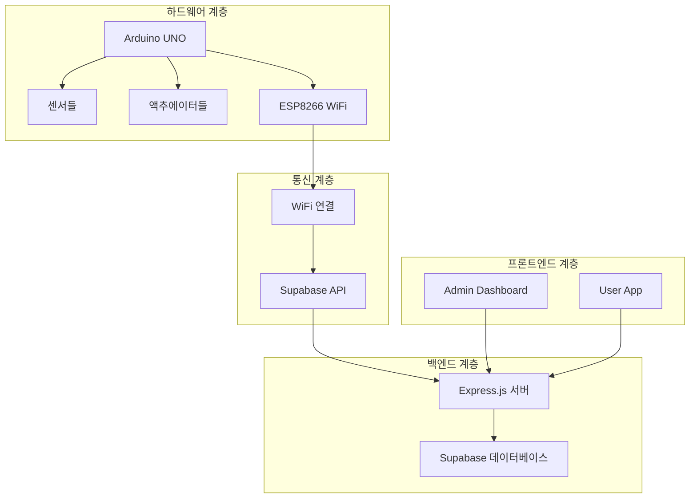
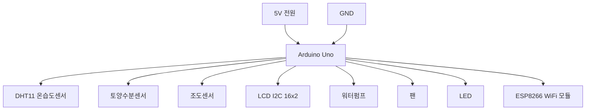
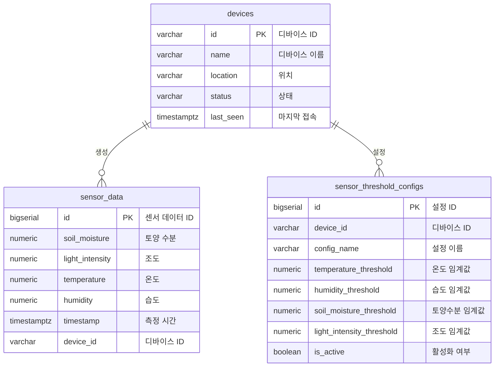
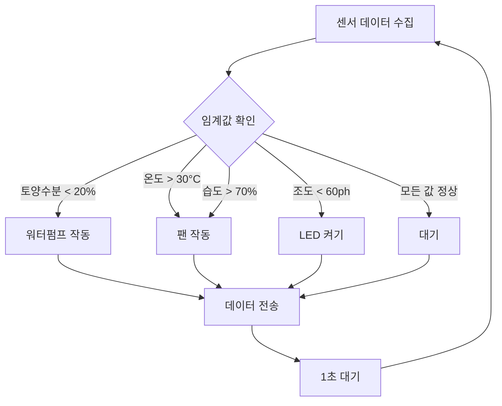
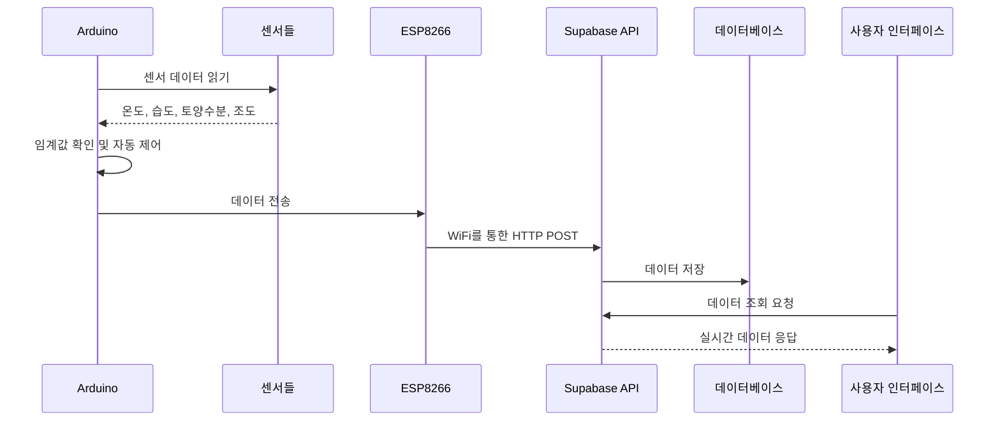

# 🌱 FarmLink 스마트팜 IoT 시스템 발표자료

---

## 슬라이드 1: 제목 슬라이드

# 🌱 FarmLink
## ESP8266 기반 스마트팜 IoT 시스템

**실시간 모니터링 & 자동 제어 솔루션**

---

## 슬라이드 2: 발표 개요

### 📋 발표 내용
- **프로젝트 소개**: FarmLink 시스템 개요
- **시스템 아키텍처**: 전체 구조 및 구성 요소
- **하드웨어 설계**: Arduino + ESP8266 기반 센서 시스템
- **소프트웨어 개발**: 백엔드 API & 프론트엔드 앱
- **데이터베이스**: Supabase 기반 데이터 관리
- **데모**: 실제 시스템 동작 시연
- **향후 계획**: 확장 및 개선 방향

---

## 슬라이드 3: 프로젝트 배경

### 🌍 왜 스마트팜인가?

**전통적 농업의 한계**
- ❌ 수동적 모니터링으로 인한 비효율성
- ❌ 환경 변화에 대한 대응 지연
- ❌ 정확한 데이터 부족으로 인한 손실

**스마트팜의 필요성**
- ✅ 실시간 환경 모니터링
- ✅ 자동화된 제어 시스템
- ✅ 데이터 기반 의사결정

---

## 슬라이드 4: FarmLink 시스템 개요

### 🎯 핵심 가치

**주요 기능**
- 🌡️ **실시간 모니터링**: 온도, 습도, 토양수분, 조도
- 🤖 **자동 제어**: 워터펌프, 팬, LED 자동 제어
- ☁️ **클라우드 연동**: Supabase를 통한 데이터 저장
- 📱 **크로스 플랫폼**: 웹과 모바일 동시 접근

---

## 슬라이드 5: 시스템 아키텍처

### 🏗️ 전체 시스템 구조

---

## 슬라이드 6: 하드웨어 구성

### 🔧 메인 하드웨어

**컨트롤러**
- **Arduino UNO**: 메인 컨트롤러
- **ESP8266 WiFi 모듈**: 무선 통신

**센서 시스템**
- **DHT11**: 온습도 센서 (Pin 4)
- **토양수분 센서**: 아날로그 센서 (A0)
- **조도 센서 (CDS)**: 아날로그 센서 (A1)

**액추에이터**
- **워터펌프**: 모터 드라이버 (Pin 9, 10)
- **팬**: 모터 드라이버 (Pin 5, 6)
- **LED**: PWM 제어 (Pin 3)

---

## 슬라이드 7: 회로도 및 연결

### ⚡ 회로 설계

**Pull-up/Pull-down 저항**
- DHT11: 4.7kΩ Pull-up
- 토양수분/조도센서: 10kΩ Pull-down
- LCD I2C: 4.7kΩ Pull-up

---

## 슬라이드 8: 소프트웨어 아키텍처

### 💻 개발 스택

**백엔드**
- **Node.js + Express.js**: REST API 서버
- **Supabase**: PostgreSQL 데이터베이스
- **TypeScript**: 타입 안전성

**프론트엔드**
- **React**: 관리자 대시보드
- **React Native**: 사용자 모바일 앱

**하드웨어**
- **Arduino C++**: 센서 제어 및 데이터 수집
- **Python**: 제어 스크립트

---

## 슬라이드 9: 데이터베이스 설계

### 🗄️ 데이터베이스 구조

---

## 슬라이드 10: API 설계

### 🔌 REST API 엔드포인트

**센서 데이터 API**
- `POST /api/sensor-data` - 센서 데이터 저장
- `GET /api/sensor-data` - 센서 데이터 조회
- `GET /api/sensor-data/stats` - 센서 데이터 통계

**디바이스 관리 API**
- `GET /api/devices` - 디바이스 목록 조회
- `GET /api/device-status/:deviceId` - 디바이스 상태 조회

**임계치 설정 API**
- `GET /api/threshold-configs/:deviceId` - 임계치 설정 조회
- `POST /api/threshold-configs/:deviceId` - 임계치 설정 생성
- `PUT /api/threshold-configs/:id` - 임계치 설정 업데이트

**제어 API**
- `POST /api/control/:deviceId` - 디바이스 제어

---

## 슬라이드 11: 자동 제어 로직

### 🤖 스마트 제어 시스템

**임계값 설정**
- 토양수분: 20% 미만 → 워터펌프 작동
- 온도: 30°C 초과 → 팬 작동
- 습도: 70% 초과 → 팬 작동
- 조도: 60ph 미만 → LED 작동

---

## 슬라이드 12: 사용자 인터페이스

### 📱 프론트엔드 구성

**관리자 대시보드 (React)**
- 📊 실시간 센서 데이터 모니터링
- ⚙️ 임계값 설정 및 제어
- 📈 데이터 통계 및 차트
- 🔧 디바이스 관리

**사용자 앱 (React Native)**
- 📱 모바일 친화적 UI
- 🔄 자동 새로고침 (5초 간격)
- 🎨 직관적인 카드 형태 데이터 표시
- 📊 센서 상태 색상 표시

---

## 슬라이드 13: 시스템 동작 흐름

### 🔄 전체 프로세스

---

## 슬라이드 14: 기술적 특징

### ⚡ 핵심 기술

**하드웨어**
- ✅ **실시간 센서 모니터링**: 1초 간격 데이터 수집
- ✅ **안정적인 통신**: ESP8266 WiFi 모듈
- ✅ **자동 제어**: 임계값 기반 스마트 제어
- ✅ **현장 모니터링**: LCD 디스플레이

**소프트웨어**
- ✅ **타입 안전성**: TypeScript 기반 개발
- ✅ **확장성**: 모듈화된 구조
- ✅ **보안**: Row Level Security (RLS)
- ✅ **성능**: 인덱스 최적화

**데이터**
- ✅ **실시간 저장**: Supabase 클라우드
- ✅ **통계 분석**: 집계 함수 활용
- ✅ **백업**: 자동 백업 시스템

---

## 슬라이드 15: 프로젝트 성과

### 🏆 개발 완료 항목

**✅ 하드웨어 개발**
- Arduino + ESP8266 기반 센서 시스템
- 회로 설계 및 Pull-up/Pull-down 저항 적용
- 자동 제어 로직 구현

**✅ 백엔드 개발**
- Express.js 기반 REST API 서버
- Supabase 데이터베이스 설계 및 구현
- TypeScript 타입 정의

**✅ 프론트엔드 개발**
- React 관리자 대시보드
- React Native 사용자 앱

**✅ 문서화**
- 상세한 API 문서
- 데이터베이스 ERD 및 테이블 정의서
- 회로도 및 하드웨어 연결 가이드

---

## 슬라이드 16: 데모 시연

### 🎬 실제 시스템 동작

**1. 센서 데이터 수집**
- Arduino에서 실시간 센서 데이터 읽기
- LCD에 현재 상태 표시

**2. 자동 제어 동작**
- 토양수분 부족 시 워터펌프 자동 작동
- 온도/습도 초과 시 팬 자동 작동
- 조도 부족 시 LED 자동 켜기

**3. 클라우드 연동**
- ESP8266을 통한 WiFi 데이터 전송
- Supabase 데이터베이스 저장 확인

**4. 사용자 인터페이스**
- 웹 대시보드에서 실시간 모니터링
- 모바일 앱에서 데이터 확인

---

## 슬라이드 17: 확장 가능성

### 🚀 향후 개발 계획

**하드웨어 확장**
- 📷 **카메라 모듈**: 식물 성장 모니터링
- 🌡️ **추가 센서**: pH, EC, CO2 센서
- 🔋 **배터리 시스템**: 무선 전원 공급
- 📡 **LoRa 통신**: 장거리 통신

**소프트웨어 개선**
- 🤖 **AI 분석**: 머신러닝 기반 예측
- 📊 **고급 분석**: 데이터 마이닝 및 패턴 분석
- 🔔 **알림 시스템**: 이메일, SMS, 푸시 알림
- 👥 **사용자 관리**: 다중 사용자 지원

**플랫폼 확장**
- 🌐 **웹 대시보드**: 고급 분석 도구
- 📱 **모바일 앱**: iOS/Android 네이티브 앱
- 🔌 **API 확장**: 서드파티 연동

---

## 슬라이드 18: 비즈니스 가치

### 💼 상업적 활용 가능성

**농업 현장 적용**
- 🏭 **대규모 농장**: 자동화된 환경 관리
- 🏠 **소규모 농장**: 비용 효율적인 스마트팜
- 🌱 **실험실**: 정밀한 환경 제어

**기술적 우위**
- ⚡ **실시간 모니터링**: 즉각적인 대응
- 🤖 **자동 제어**: 인력 비용 절감
- 📊 **데이터 기반**: 과학적 의사결정
- 🔧 **확장성**: 다양한 환경 적용 가능

**시장 기회**
- 🌍 **글로벌 시장**: 스마트팜 시장 성장
- 🏢 **B2B 솔루션**: 농업 기업 대상
- 🏪 **B2C 제품**: 개인 농업인 대상

---

## 슬라이드 19: 기술적 도전과 해결

### 🔧 개발 과정에서의 도전

**하드웨어 도전**
- ❌ **전압 레벨 불일치**: ESP8266 3.3V vs Arduino 5V
- ✅ **해결**: 전압 분압기 및 레귤레이터 사용

- ❌ **신호 안정성**: 센서 노이즈 및 플로팅
- ✅ **해결**: Pull-up/Pull-down 저항 적용

**소프트웨어 도전**
- ❌ **데이터 동기화**: 실시간 데이터 전송
- ✅ **해결**: 5초 간격 배치 전송 및 오류 처리

- ❌ **타입 안전성**: JavaScript 동적 타입
- ✅ **해결**: TypeScript 도입 및 엄격한 타입 정의

**통신 도전**
- ❌ **WiFi 연결 불안정**: 네트워크 끊김
- ✅ **해결**: 재연결 로직 및 USB 백업 시스템

---

## 슬라이드 20: 결론 및 향후 계획

### 🎯 프로젝트 성과

**✅ 달성한 목표**
- 실시간 센서 모니터링 시스템 구축
- 자동 제어 로직 구현
- 클라우드 기반 데이터 관리
- 사용자 친화적 인터페이스 개발

**🚀 향후 계획**
- 하드웨어 안정성 개선
- AI 기반 예측 시스템 도입
- 상용화를 위한 제품화
- 국내외 농업 현장 적용

**💡 핵심 가치**
- **혁신**: IoT 기술을 활용한 농업 혁신
- **효율성**: 자동화를 통한 생산성 향상
- **지속가능성**: 데이터 기반 지속가능한 농업
- **접근성**: 누구나 사용할 수 있는 스마트팜

---

## 슬라이드 21: Q&A

### ❓ 질문과 답변

**자주 묻는 질문**

**Q: 시스템의 전력 소비는 어느 정도인가요?**
A: Arduino UNO + ESP8266 기준 약 200mA, 5V 전원으로 동작합니다.

**Q: 센서 데이터는 얼마나 자주 수집되나요?**
A: 1초마다 센서 데이터를 읽고, 5초마다 클라우드에 전송합니다.

**Q: WiFi 연결이 끊어지면 어떻게 되나요?**
A: USB 백업 시스템이 있어 로컬에서 데이터를 수집하고 저장할 수 있습니다.

**Q: 다른 센서를 추가할 수 있나요?**
A: 네, 모듈화된 구조로 새로운 센서 추가가 용이합니다.

---

## 슬라이드 22: 감사합니다

### 🙏 Thank You

# 🌱 FarmLink
## ESP8266 기반 스마트팜 IoT 시스템

**실시간 모니터링 & 자동 제어 솔루션**

---

**문의사항이나 추가 정보가 필요하시면 언제든 연락주세요!**

📧 Email: your-email@example.com  
🌐 GitHub: https://github.com/your-repo/farmlink  
📚 문서: [프로젝트 문서](docs/)

---

**🌱 스마트한 농업의 미래를 함께 만들어가요! 🌱**

